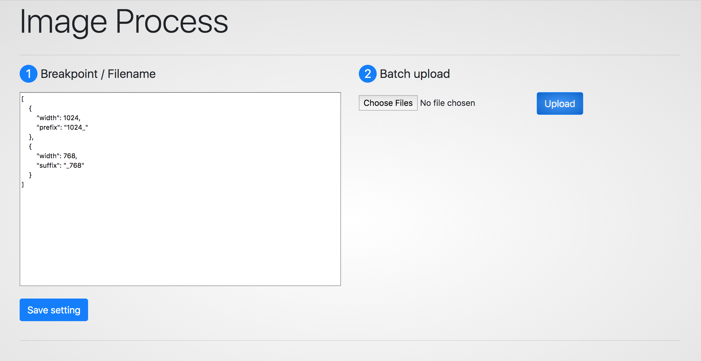
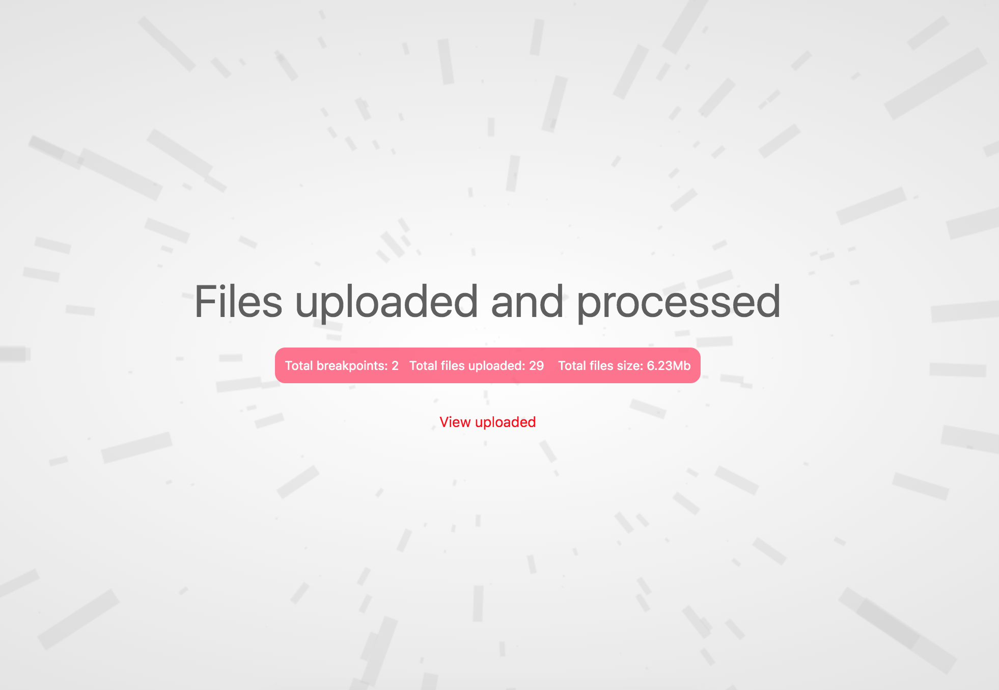
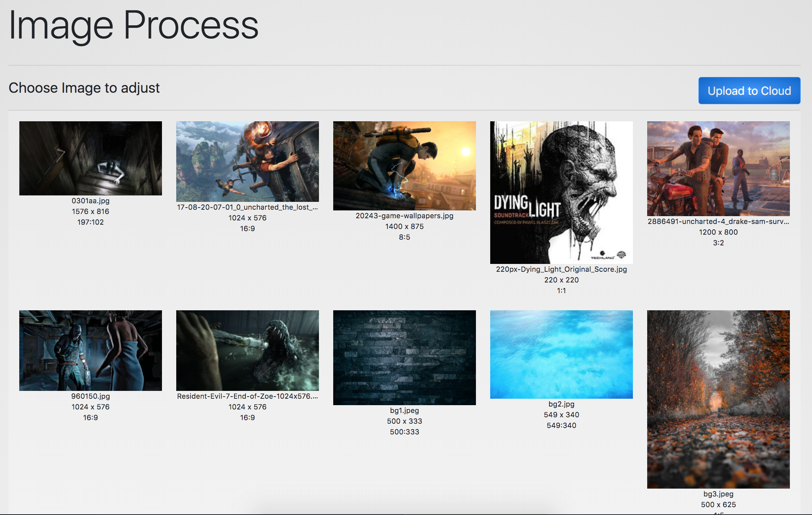
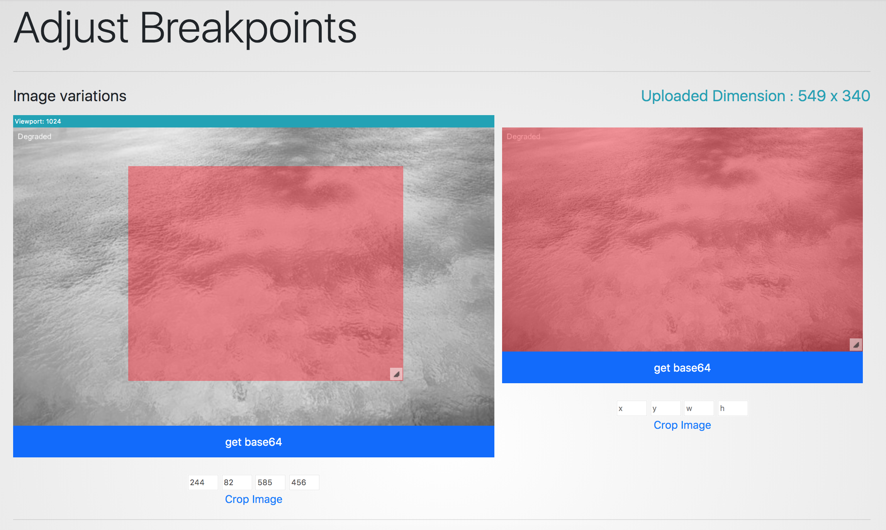
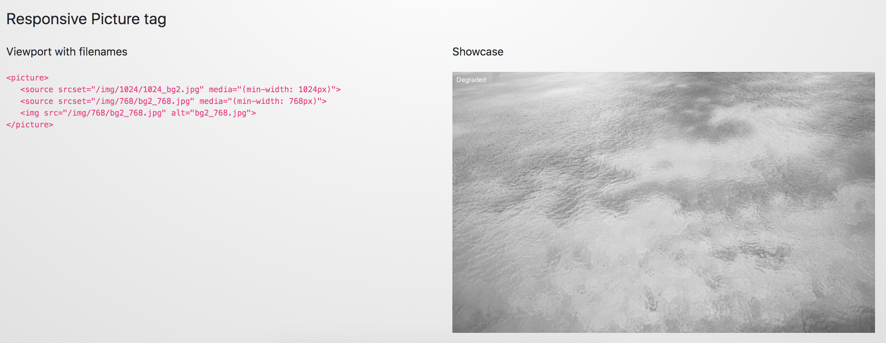
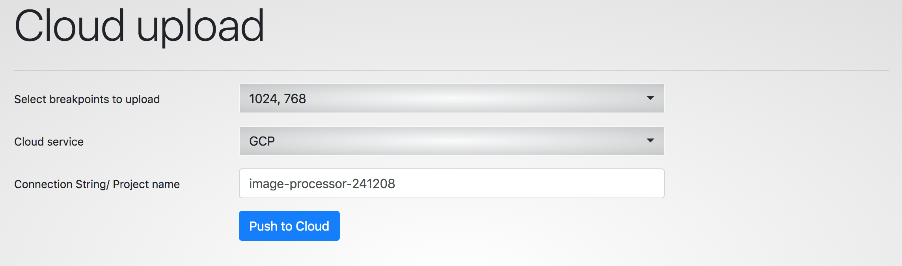
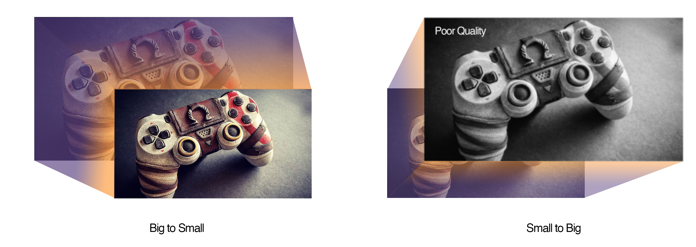

    

# image-processor
Simple tool for batch processing the images with breakpoints and uploading it to Cloud. This tool uses [Jimp](https://github.com/oliver-moran/jimp) for image processing

## Modify Settings   
Modify and save setting as per your need. Setting includes viewport size, file prefix, file suffix

```
// Array of viewports, in which images will be converted
[
        {
            "width": 1024,
            "prefix": "1024_" 
        },
        {
            "width": 768,
            "suffix": "_768"
        }
]
```


## Upload File(s)
Upload single or multilple files. This will use the saved setting and generate the physical files based on the viewports provided in settings





### View Uploded/Generated files
The details of original uploaded files can be viewed with the details like (original dimension, ratio of the image and image name).   
   
Image can be separately clicked for viewport versions, where cropping for specific viewports can also be performed. Additionaly dynamic responsive tage and base 64 for each image can also be generated








### Upload to Cloud
Feature for uploading the generated files to cloud storage is also available. Supported cloud services are Azure Blob Storage & Google Cloud Storage
     

    
For Azure Blob storage, connection string of the storage account is needed.   
   
For Google cloud Storage, [these](./key/README.md) steps need to be followed.


## More information

Expectation for generating a lower dimension files to higher viewport is also in place. Files converted to higher viewport will be in degraded quality

